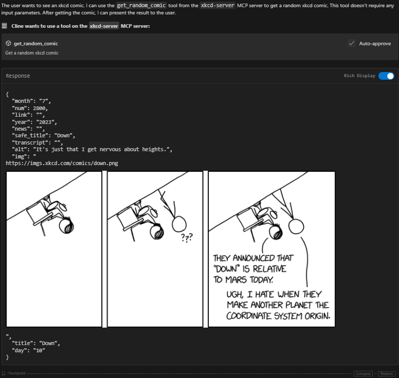

A simple mcp implementation to connect to the xkcd-server api and retrieve a random xkcd comics.

Cline example:



# Example cline setup
```
{
  "mcpServers": {
    "xkcd-server": {
      "autoApprove": [
        "get_random_comic"
      ],
      "disabled": false,
      "timeout": 60,
      "command": "node",
      "args": [
        "<absolute path to xkcd-server\\build\\index.js"
      ],
      "transportType": "stdio"
    }
  }
}
    ```

    